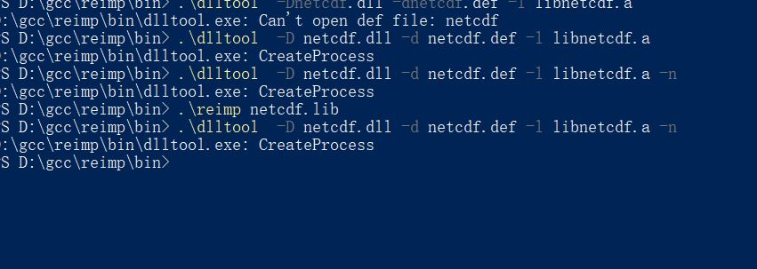

# go-netcdf-oc
Try to use go ,cgo,and netcdf'go_libary to learn how to use oc to discover the world. 

## 这是复现一个论文的实验所以进行的操作
因为最近觉得c/c++太操蛋了，尤其是之前我用hdf库读取modis L16的数据的时候 。

不过现在觉得还行，因为netcdf和hdf都是给了c库所以用c最合适，实在不行用c读了，写到文件里再用其他的文件流来读都比用第三方库用起来舒服。
当然netcdf给了py库。用py还是不错的，毕竟用py的人太多了。
说实在的，处理图像还是用idl或者c/c++最合适，因为idl是专门处理各种图像的，c/c++库多啊。Fortran也行，毕竟很多老教授不会用新货，所以库也不少。
然而，因为我不喜欢用py。
也不喜欢用idl。
又觉得c/c++各种内存管理的操蛋。
更因为我为啥要学这个啊！！！！！！
所以，我选了go，因为有个cgo还允许使用c的各种库。
但是问题就来了！！！！！！！
我在win下用go的时候，cgo使用的 ccomplier是gcc，然后大部分给过的编译库都是用vs编译的，如果只是编译出一堆静态lib多棒啊，可是操蛋的是！！！！！
它们居然编译成动态dll然后用lib当作dll入口。然后我一开始找资料以为把lib转为a就行，然后资料上也说行啊，但是这个lib是静态lib，不是netcdf库那种lib动态dll入口的lib，但是我仍然尝试了各种方法，用lib转def，用dll转def，然后再用mingw的工具生成.a文件，但就是不行。。。
后来我想，不行，这个很操蛋，换个法子。
于是我想是不是没找到函数指针，所以干脆直接把lib和dll合成一个a库链接不就行了，后来发现也不行，因为各种原因，其实是我不知道。。。

后来我找资料发现，gcc在win下居然是模拟linux进行地，也就是说找到.so或者原生.a就行。于是我想要不就直接在linux上apt安装这个库再复制过来呗。
但是我想，不行啊，因为如果是这样调用系统api不一样啊，所以暂时先否决了这个方法。
于是我想，要不然在win下用cmake和make编译一遍netcdf 因为这样产生的文件就是.so和.a库了，所以我尝试编译了一下，然后发现，不行！！！
因为netcdf库还要hdf4，hdf5，lcurl库，太麻烦了。不行。
那也别放弃啊。
于是死马当活马医了。
在我的vps上apt安装了这个库，找到了.so文件，然后下载到本地，放在lib文件夹里，嗯！！！！！！开心，居然编译成了。但是此时的我心中浮现一丝阴霾。
为什么呢。因为so库是动态库啊，linux中如果要运行文件的话必须得有这个库啊。于是我在win上做了测试，发现，不用这个so库也运行，所以我推断应该是把函数的实现编译到了程序里，那么原因我觉得是1、大部分不允许访问elf格式的so库，因为没有gcc模拟linux.2、gcc尽管在win下允许生成dll库，但是一般情况下不产生dll，因为没有此参数或者太麻烦.3、gcc直接编译进程序要比生成dll库更合适。
但是还有一个问题，为什么编译时是不同系统也允许混用呢？1、大概是因为这个库的特殊，它调用了系统api但是却不是放入程序中而是使用gcc的库，所以这样就任意系统混用均行.2、大概是使用了并且编译进了程序，但是只是调用了指针，于是在不同的系统上的gcc发现这种调用，于是使用了当前系统合适的api.3、win下的gcc是模拟Linux使用的，这就意味着，添加了一个中间层，也就是说程序在编译时先调用linux模拟然后gcc在调用api之后再把程序和win下的api链接，生成没有中间层的标准程序（pe格式）（当然用到的各种库和第三方库so和a一定是elf结构，因为这个就是在linux模拟时链接，linuxapi与winapi的链接是gcc内部库，不允许使用各种库和第三方库。）。
那么这样就正常使用go来利用cgo读取netcdf文件了。
### 但是以后如果遇到这样麻烦的情况，或者是没有给出go的库而只有c/c++的库（一般都会给c/c++的库）
1、直接使用给出的库使用的语言（一般还是使用c/c++，除非真的没有给c/c++库）然后转换为其他格式的数据文件，或者干脆直接转xml，反正只要不改变文件内数据的精确度就行。
2、如果给了c/c++的库，并且使用cgo编译不是特别麻烦，就采用cgo来完成。
3、如果给出了库，并且在linux下操作比较简单，那么就采用linux虚拟机来处理，毕竟这种方式处理的话只是进行格式转换，不需要多快速的机器。
### 吐槽
1、为什么要造各种奇怪的格式啊！！！！！！真的很麻烦的。大概是因为数据量以及版权。
2、为什么不给go库啊！！！！！！因为大部分数据格式很老了，go还没出现，并且使用go不多。
3、为什么大部分美国科研机构在开发的时候都优先开发linux的呢！！！！！！因为它们接触电脑很早了，一开始大部分使用unix然后教学就这样，于是就是代代相传，并且也是因为版权的影响。

另外！！！！！，真的不要太相信网络上的资料以及不良开发者，有些不全，有些使用条件不合适，有些就是错误的！！！！！

那么去哪里找解决方案呢！！！！！！1、各种官方文档。2、去搜索引擎搜索。

还有就是cmake，make，automake，nmake，./configure这种编译工具链太麻烦了。当然是1、cmake-make.2、cmake-nmake.3、automake-./configure。当然也有直接写makefiles然后直接make的。
 
